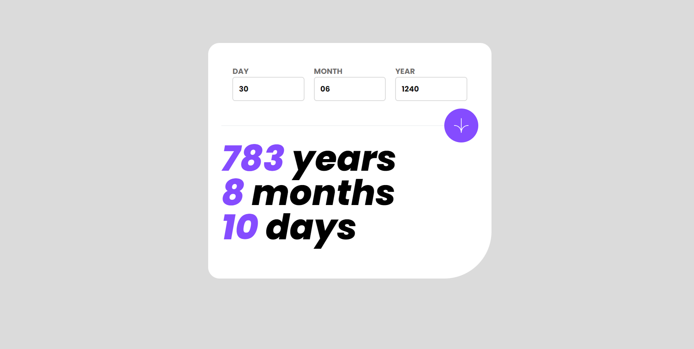
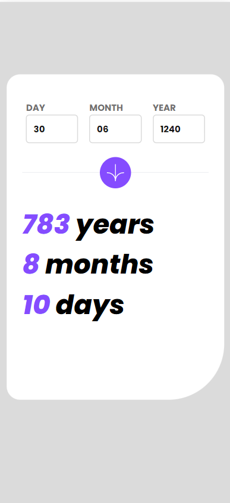

# Frontend Mentor - Age calculator app solution

This is a solution to the [Age calculator app challenge on Frontend Mentor](https://www.frontendmentor.io/challenges/age-calculator-app-dF9DFFpj-Q). Frontend Mentor challenges help you improve your coding skills by building realistic projects. 

## Table of contents

- [Overview](#overview)
  - [The challenge](#the-challenge)
  - [Screenshot](#screenshot)
  - [Links](#links)
- [My process](#my-process)
  - [Built with](#built-with)
  - [What I learned](#what-i-learned)
  - [Continued development](#continued-development)
  - [Useful resources](#useful-resources)
- [Author](#author)
- [Acknowledgments](#acknowledgments)

**Note: Delete this note and update the table of contents based on what sections you keep.**

## Overview

### The challenge

Users should be able to:

- View an age in years, months, and days after submitting a valid date through the form
- Receive validation errors if:
  - Any field is empty when the form is submitted
  - The day number is not between 1-31
  - The month number is not between 1-12
  - The year is in the future
  - The date is invalid e.g. 31/04/1991 (there are 30 days in April)
- View the optimal layout for the interface depending on their device's screen size
- See hover and focus states for all interactive elements on the page
- **Bonus**: See the age numbers animate to their final number when the form is submitted

### Screenshot

#### Desktop

#### Mobile

### Links

- Solution URL: [Add solution URL here](https://your-solution-url.com)
- Live Site URL: [Add live site URL here](https://your-live-site-url.com)

## My process

### Built with

- Mobile-first workflow
- Tailwind CSS
- TypeScript
- [React](https://reactjs.org/) - JS library
- [Vite](https://vitejs.dev/)

### What I learned

In this project, I have the opportunity to apply and enhance my understanding of TypeScript, allowing me to become more accustomed to its fundamental concept of typing. I am attempting to create a custom class using Tailwind CSS.

Additionally, I have the opportunity to reinforce my comprehension of state management in ReactJS through practical application.

Furthermore, I am also gaining a stronger grasp of handling and utilizing props effectively.

### Continued development

Certain aspects of responsiveness are not fully optimized at the moment. I am still in the process of determining the most suitable approach for creating animations when the results change. Additionally, I've encountered a challenge in altering the input border while it's in focus. 
Moving forward, my objective is to devise effective solutions for these issues and implement them successfully.

## Author

- Frontend Mentor - [@hnvkhanh](https://www.frontendmentor.io/profile/hnvkhanh)

